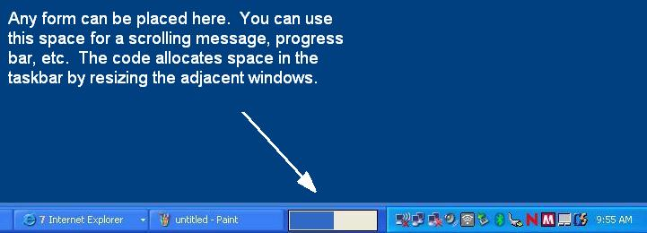



## Allocate space in the taskbar for a form/control

### Description

Check out the screenshot... A while back, I purchased an IBM laptop whose battery meter took up space in the task bar between the task switcher and notify icon area. I recently had a need for recreate this functionality and thought I would share the solution. I've seen other code on PSC that "mimics" this but they don't actually allocate space in the Shell_TrayWnd window for a new form. This one does! The code uses all API...
 
### More Info
 
All of the logic is contained in a single function called AttachForm. Pass this function the form and and sizing parameters. You can call the DetachForm function if you want to remove the form during run-time.

The concept is actually quite simple....

1 - Find the window handles of the task bar (Shell_TrayWnd), task switcher (ReBar_Window32) notify icon area (TrayNotifyWnd), etc.

2 - Set the parent of our form to be the taskbar

3 - Resize the task switcher and notify areas to accompdate our form/control.

4 - Timer checks to see if and taskbar windows have been resized (notify icons added, task bar moved, etc). I haven't found any message hook yet so I had to use a timer.

             |
---                |---
**Submitted On**   |2006-05-03 10:19:48
**By**             |[Dan Tesenair](https://github.com/Planet-Source-Code/PSCIndex/blob/master/ByAuthor/dan-tesenair.md)
**Level**          |Advanced
**User Rating**    |4.9 (83 globes from 17 users)
**Compatibility**  |VB 6\.0
**Category**       |[Custom Controls/ Forms/  Menus](https://github.com/Planet-Source-Code/PSCIndex/blob/master/ByCategory/custom-controls-forms-menus__1-4.md)
**World**          |[Visual Basic](https://github.com/Planet-Source-Code/PSCIndex/blob/master/ByWorld/visual-basic.md)
**Archive File**   |[Allocate\_s199181532006\.zip](https://github.com/Planet-Source-Code/dan-tesenair-allocate-space-in-the-taskbar-for-a-form-control__1-65167/archive/master.zip)

